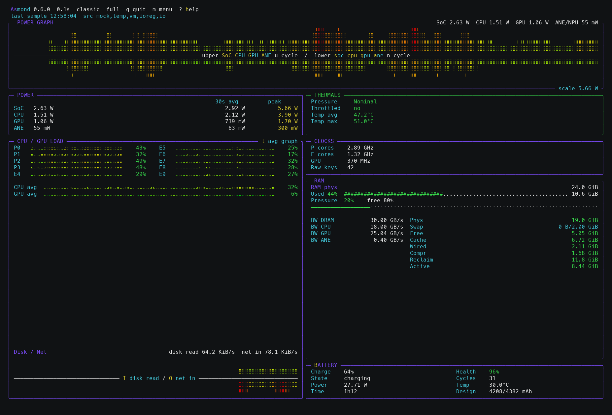
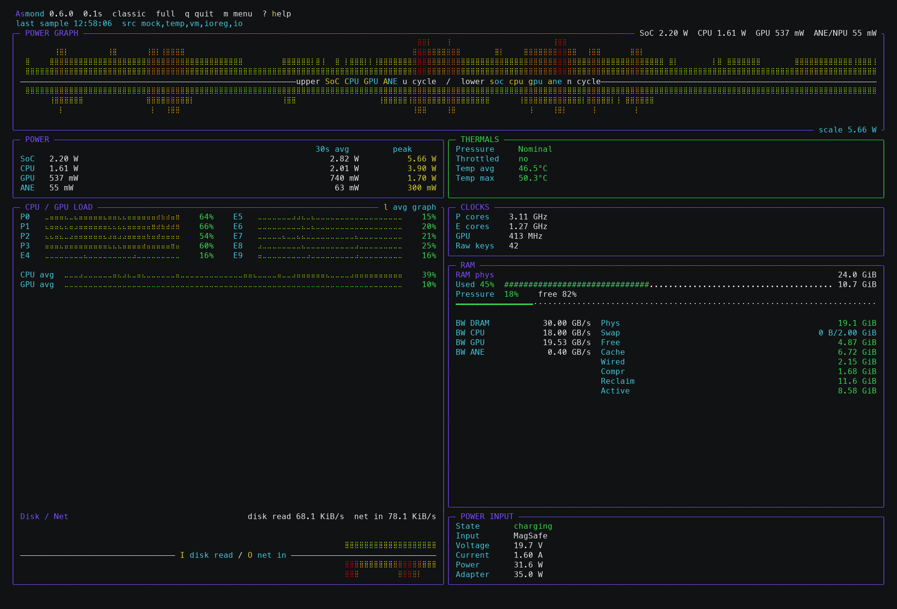
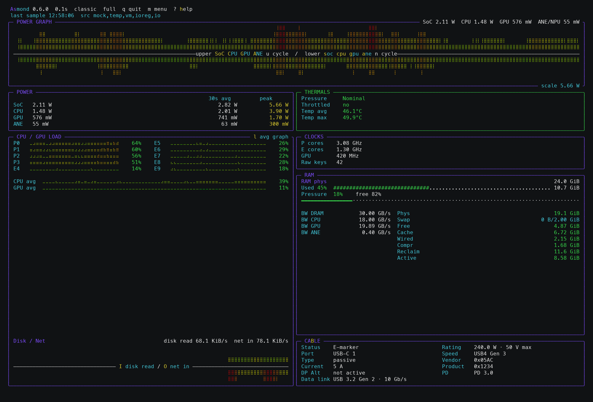
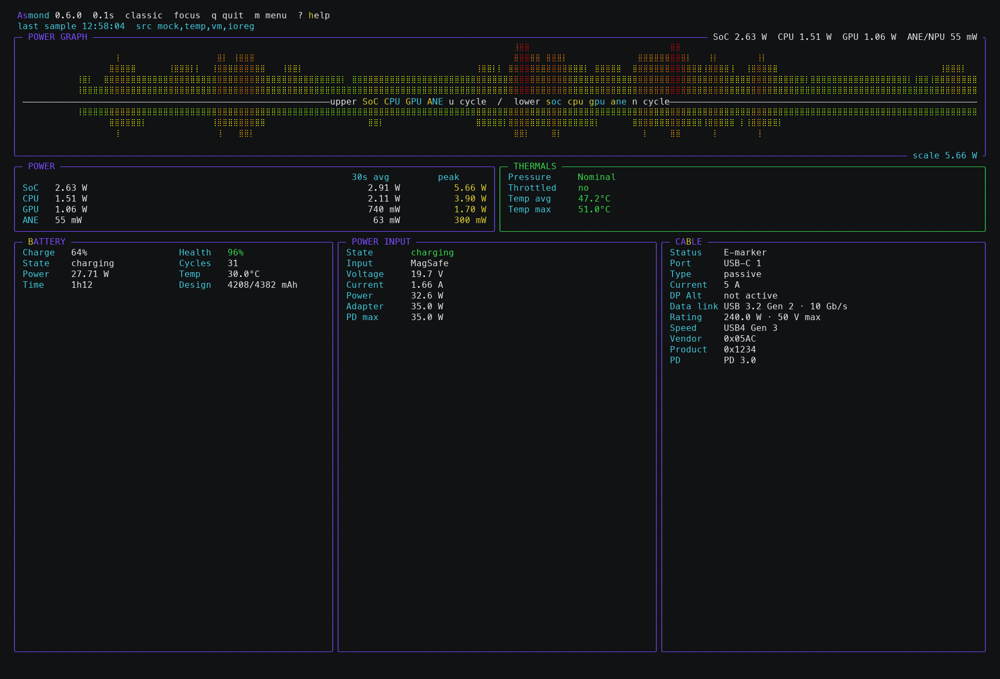

# Asmond

Asmond is a macOS power, thermal and activity monitor focused on Apple Silicon, with early experimental Intel Mac support.

It reads Apple's `powermetrics` plist stream and combines it with macOS system counters for memory, swap, battery, disk, network and process data. The project is intentionally small: a compact Python runtime, one main test file, and no third-party Python package dependencies.

## Preview



*Full layout with generated mock telemetry. The irregular workload history is illustrative; the displayed UI and available panels are from Asmond 0.6.0.*

<details>
<summary>Full layout with Power Input</summary>



</details>

<details>
<summary>Full layout with Cable details</summary>



</details>



*Focus layout showing the Battery, Power Input and Cable views together.*

## Features

- SoC or Intel package, CPU, GPU and ANE/NPU power where `powermetrics` exposes it
- Shared-scale split power graph with independently selectable upper and lower sources and an 11-step green-to-red terminal gradient where supported
- Current, 30 second average and peak values for power readings, followed by verified CPU/GPU average temperatures where available
- Thermal pressure, throttling state, hottest verified sensor with source, and additional physical sensor temperatures where available
- P-core/E-core usage rows, CPU/GPU average rows and an alternate CPU/GPU graph view
- P-core/E-core and GPU clocks, with live smoothing for idle `0 Hz` cluster samples
- RAM, swap and memory pressure using `vm_stat`, `vm.swapusage` and `memory_pressure`
- Legacy memory bandwidth counters in the RAM panel when `powermetrics` exposes `bandwidth_counters`
- Battery details in a compact two-column view: charge, state, health, capacity, cycle count, power, temperature and time remaining
- Power-input details from IOKit: USB-C/MagSafe active port, negotiated voltage/current/power and PD profiles when exposed
- Dependency-free USB-C cable view from real SOP'/SOP'' E-marker VDOs: type, current/voltage/power rating, data class, VID/PID and PD revision, plus the current data link and DP Alt Mode state from the matching port
- Optional compact disk/network I/O graph with selectable read/write sources
- Optional process panel with PID, CPU%, RAM%, RSS, and GPU% when macOS exposes a usable counter
- Layout presets: `full`, `compact`, `focus`, plus an editable `custom` layout
- Alerts for throttling, high temperature, swap usage and battery drain
- Rounded Unicode panel borders where supported, with a complete square curses border as the compatibility fallback
- Theme-colored ASCII logo on the waiting screen, help overlay and settings menu
- Local persistence for theme, interval, layout, custom slots, graph sources, process panel and alert thresholds
- `doctor` and anonymized `report` commands for troubleshooting

## Requirements

- macOS; Apple Silicon is the primary supported target, Intel Macs are experimental
- Python 3.10 or newer
- `sudo` access only for live `powermetrics` telemetry

Intel Macs are experimental. Asmond can read a smaller set of Intel `powermetrics` counters on tested hardware, but Apple Silicon remains the primary supported target.

`requirements.txt` is intentionally empty of package requirements.

The live dashboard, `probe`, and `report --live` use `sudo` only to start Apple's `powermetrics`. The Asmond UI remains unprivileged. Generated mock data, `doctor`, and the default non-live `report` do not require `sudo`; `doctor --live` only uses an already cached credential and never prompts for a password.

## Installation

With Homebrew:

```bash
brew tap Fxxrz/asmond
brew install asmond
```

Update an existing Homebrew installation:

```bash
brew update
brew upgrade asmond
```

Run Asmond:

```bash
asmond
```

Or run directly from a source checkout:

```bash
git clone https://github.com/Fxxrz/asmond.git
cd asmond
python3 asmond.py
```

Asmond keeps the terminal UI unprivileged and starts only `powermetrics` with `sudo`. Trusted macOS tools are invoked through fixed system paths rather than the user's `PATH`.
Homebrew also installs the manual page, available as `man asmond`.

## Usage

The examples below use the Homebrew command. From a source checkout, replace `asmond` with `python3 asmond.py`.

Run the dashboard:

```bash
asmond
```

Run with generated demo data:

```bash
asmond --mock
```

Show one parsed sample:

```bash
asmond probe
```

Inspect raw flattened `powermetrics` keys and values:

```bash
asmond probe --raw
```

`probe --raw` is not anonymized. Prefer `asmond report` for public bug reports.

Check local data sources without starting the TUI:

```bash
asmond doctor
asmond doctor --json
asmond doctor --live
```

`doctor --live` checks one real sample only when the current `sudo` credential is already cached; it does not prompt.

Create an anonymized support report:

```bash
asmond report
asmond report --json
asmond report --live
```

Show the installed version:

```bash
asmond --version
```

Print the settings path:

```bash
asmond --config-path
```

Useful options:

```bash
asmond -i 0.2 --history 240 --theme nord
asmond --theme dracula --layout compact --show-io
```

Run tests:

```bash
python3 -m unittest -v
```

Measure test coverage:

```bash
python3 -m pip install -r requirements-dev.txt
python3 -m coverage run -m unittest
python3 -m coverage report
```

Preview the manual page from a checkout:

```bash
man ./man/asmond.1
```

## Controls

```text
q       quit
? / h   toggle help overlay
m       toggle settings menu
t       cycle theme
T       tailor mode for numbered custom-layout slots
+/-     change and apply sample interval, down to 0.1s
r       reset power graph history and peaks
v       cycle layout preset: full, compact, focus, custom
d       show or hide Disk/Network I/O panel
i       cycle the upper Disk/Network graph source
o       cycle the lower Disk/Network graph source
L       toggle CPU/GPU average view
b       cycle charge panel: Battery, Power Input, Cable
S/C/G/A select SoC/package, CPU, GPU or ANE/NPU for the upper power graph
s/c/g/a select SoC/package, CPU, GPU or ANE/NPU for the lower power graph
u       cycle the upper power graph
n       cycle the lower power graph
p       cycle process panel: hidden, left, right
up/down select process
left/right change process sort: CPU, GPU, RAM, PID, name
k       mark selected process, press k again to send TERM
```

In the settings menu, use Up/Down or Tab to move, Left/Right or Enter to change a value, `s` to save and Esc to close.

When the `custom` layout is active, press `T` to enter Tailor mode. The editable slots are numbered directly on the dashboard. Press a number to open the small slot editor away from that panel, then use Up/Down, Left/Right and Enter to change the slot, panel, detail level or custom layout name. Panels without meaningful detail variants keep a single fixed detail value. `T` or Esc closes Tailor mode.

The `focus` layout is the combined power/thermal view. Older saved settings named `power-only` or `thermals-only` are mapped to `focus` automatically.

Process termination uses the current user's permissions. The full TUI refuses root launches by default; use normal `asmond` so only `powermetrics` receives elevated privileges. Root UI mode exists only as an explicit override with `--allow-root-ui`, and root process termination remains disabled unless enabled again for that session. A root process does not write settings, so neither that permission nor other root-session changes are persisted.

Asmond refreshes the existing `sudo` timestamp while live telemetry is running. It deliberately does not call `sudo -k` on exit because doing so could revoke a credential that existed before Asmond started.

Settings are saved in:

```text
~/Library/Application Support/Asmond/settings.json
```

If Asmond is explicitly launched via `sudo` for a non-dashboard command, the settings path is resolved through `SUDO_USER` so the file still belongs to the real user.

Command-line help shows the currently saved defaults for options such as interval, theme and layout.

Remove saved settings:

```bash
asmond --remove-settings
```

Homebrew does not remove per-user settings automatically on uninstall. To remove everything:

```bash
asmond --remove-settings
brew uninstall asmond
```

## Themes

Available themes:

```text
classic matrix solar mono nord dracula ocean ember
```

## Data Accuracy

Asmond prefers exposed macOS counters over estimates. Some values are not publicly available on every system. ANE/NPU frequency is hidden because there is no reliable public counter, and ANE/NPU usage is shown only when `powermetrics` exposes a real active-residency counter; ANE power is never converted into an estimated percentage. Media Engine counters are kept as best-effort diagnostic data and appear in probe output only when the local `powermetrics` output contains usable fields.

Values explicitly marked invalid by `powermetrics`, negative sentinel values and non-finite numbers are treated as unavailable. If the main stream exits or stops producing fresh data, the dashboard marks the sample stale and retries the sampler with bounded backoff.

Graph colors use an 11-step green-to-yellow-to-red palette when the terminal exposes at least 256 colors. Terminals with fewer colors automatically retain the existing green/yellow/red thresholds, while the intentionally monochrome `mono` theme remains monochrome on every terminal. Power and I/O graph colors describe a sample's position relative to the graph's current scale; red therefore means near that displayed scale maximum, not necessarily a critical hardware state. The graph geometry and underlying values are unchanged.

Thermal pressure is shown exactly as macOS reports it. A `Throttled` state is set only from an explicitly active throttle, PROCHOT or Plimit signal, or from a macOS pressure state of `Serious`, `Heavy` or `Critical`. Intel `perf_limit_reasons` are displayed separately as `Perf reason` because `powermetrics` does not identify those strings as current versus latched state; normal turbo-control reasons can also appear while thermal pressure is `Nominal`. Asmond therefore preserves those reported reasons without turning them into an inferred thermal-throttling state.

On the base Apple M4 with four performance and six efficiency cores, CPU and GPU temperature averages/maxima come from read-only AppleSMC sensor groups verified against per-core readings and separate CPU/Metal load tests. Their averages appear beside CPU/GPU power; SoC and ANE rows remain `n/a` because no verified temperature mapping is assigned to them. When a CPU core is the hottest verified sensor, the Thermals panel identifies its efficiency/performance core, for example `44.0°C · CPU@E6`; narrow panels shorten that source to `E6` rather than clipping it. On the tested machine the panel can additionally show the real Power Manager Die average plus AppleSMC power-supply, Wi-Fi/AirPort, trackpad and trackpad-actuator sensors. These are kept separate rather than being relabelled as CPU or SoC temperatures.

If one CPU SMC key is temporarily unavailable, Asmond does not publish an incomplete CPU average. Independently valid GPU and auxiliary SMC values still contribute to the real maximum and alerts, however. Every effective maximum carries its concrete source (`CPU@…`, `GPU`, `PMU`, `IOHID`, `powermetrics` or a named auxiliary sensor), while the overall source records combinations such as `AppleSMC + IOHID`. The TUI hotspot, alert threshold, `probe` output and JSON report therefore use the same maximum during a partial sensor read. Once the complete verified CPU SMC group is available, its physical sensor set is authoritative and an unlabelled generic fallback does not silently replace it.

The lower `PMU tdie` readings exposed through IOHID are power-manager-die sensors, not CPU-core temperatures. The tested M4 exposes neither a named `SOC MTR Temp Sensor` nor a named `ANE MTR Temp Sensor` through IOHID. The available `TCMz` SMC value tracks CPU-die maximum and is therefore not relabelled as SoC temperature; low-confidence shared ANE candidates are also rejected. Other Apple Silicon variants keep their existing named IOHID fallback until their SMC key groups are validated; Asmond does not extrapolate an M4 mapping to a different SoC or core topology. Reading AppleSMC does not require `sudo` and adds no package dependency. At dashboard intervals below 0.75 seconds, the most recent real SMC/IOHID read is reused until the next 0.75-second sensor refresh so a slow hardware read cannot block the faster `powermetrics` pipe; values are never interpolated or estimated.

Battery health uses the nominal/full and design capacities exposed by `AppleSmartBattery`, including the nested `BatteryData` fields used by newer macOS versions. Battery temperature continues to prefer the existing `AppleSmartBattery` temperature fields and falls back to Apple's IOHID gas-gauge battery sensors when those fields are absent.

In the full dashboard, the four-row Battery view uses a six-line panel including its border and gives the two saved lines to RAM. The Power Input and Cable views retain an eight-line panel because they have additional fields. Press `b` to cycle `Battery`, `Power Input` and `Cable`; switching recalculates the layout immediately, including capability fallback when a source is unavailable. `Power Input` is deliberately generic: its `Input` row still identifies the real source as USB-C, MagSafe or legacy AC input.

On legacy Intel batteries, Apple's exposed full-charge capacity can move with battery state and load, so the displayed health percentage can move with it. Asmond reports that current capacity estimate and deliberately does not substitute the separate diagnostic `Qmax` value.

Apple Silicon is the stable primary platform. Intel Mac support remains experimental and intentionally conservative until it has been exercised across more machines and macOS versions. On the tested Intel Mac mini and MacBook Air hardware, Asmond can read package/CPU/iGPU power, CPU/GPU load, clocks, RAM, swap, disk/network I/O and process data. Intel package power is labelled `Package` rather than `SoC`, and `probe` uses the same Mach CPU-load source as the dashboard and live report. The MacBook Air path also reads CPU-die temperature, fan speed, battery capacity and legacy MagSafe adapter telemetry when `powermetrics` and IOKit expose them. SMC data can be temporarily unavailable on some samples; unsupported counters stay hidden or show `n/a` rather than estimated values.

Per-process GPU% is a legacy, best-effort path. `powermetrics --show-process-gpu` documents per-process GPU time, but Apple notes that it is only available on certain hardware. Current tested Apple Silicon/macOS builds either omit the counter from plist output or report only zeroes in text output; in that case Asmond hides the GPU% process column instead of showing misleading 0.0% values.

Memory bandwidth support is a legacy, best-effort path. Older macOS/Apple Silicon combinations exposed `bandwidth_counters` in the `powermetrics` plist stream, but this appears to be unavailable on current macOS releases and is not covered by the maintainer's current hardware tests. When the counters are present, values are grouped by visible names such as CPU, GPU, ANE, DRAM or DCS and displayed as GB/s; otherwise the bandwidth rows stay hidden.

Power-input information is decoded from the AppleSmartBattery and AppleHPMInterface IOKit trees. It supports USB-C PD, MagSafe and legacy Intel MagSafe adapter telemetry when exposed. Live voltage, current and wattage prefer measured telemetry and fall back to negotiated adapter/PD values; fixed, battery, variable and PPS request objects are decoded only with their matching USB-PD field layout. A physical `ConnectionActive` port is correlated with the global input state and per-port contract/FED evidence. `ConnectionActive` alone proves only a cable or data connection and never turns that port into a power sink. This separation also avoids trusting battery-controller contract fields that can remain stale briefly after unplugging or moving a charger.

Cable information is separate from the negotiated input contract. On Apple Silicon, Asmond reads the public `IOPortTransportComponentCCUSBPDSOPp` and `...SOPpp` IOKit services and decodes only a connected cable's own E-marker VDOs. The relatively static identity is refreshed on connection/port changes and every five seconds while connected; live charge and transport state keeps its faster polling interval. Asmond never infers a 3 A/5 A rating from the current charging draw, and lingering controller data from a disconnected port is not presented as the current cable. If macOS does not publish an E-marker response, the panel says `no E-marker data`; this does not claim that the physical cable lacks a marker. Vendor and product IDs stay numeric because Asmond does not bundle a vendor database. `Data link` and `DP Alt` are deliberately live connection states from the matching `AppleHPMInterface.TransportsActive` list. For a direct USB connection, Asmond correlates the XHCI port's `UsbIOPort` path and exact `locationID` with the directly attached `IOUSBHostDevice`, then uses its reported `UsbLinkSpeed`; for example, a real 10 Gb/s link is shown as `USB 3.2 Gen 2 · 10 Gb/s`. Ambiguous or missing topology data falls back to Apple's broader `USB2`/`USB3` transport name instead of guessing. `DP Alt: active` confirms that DisplayPort is being carried now; `not active` does not claim the cable is incapable of DisplayPort. The Mac port's generic `TransportsSupported` list is not presented as a cable feature. Intel port controllers do not expose this public cable-identity path on the tested machines, so the Cable view falls back to the available Power Input or Battery view there.

RAM labels are macOS-specific: `Used` is active plus wired memory, while `Phys` is physical occupancy (`total - free/speculative`). `Pressure` uses Apple's `memory_pressure` command when available and otherwise falls back to a reclaimable-memory estimate.

For bug reports, include `asmond doctor` and, if comfortable, `asmond report`. Use `asmond report --live` only when a live `powermetrics` snapshot is relevant.

Security issues should be reported privately as described in [SECURITY.md](SECURITY.md). Do not attach raw `probe --raw` output to a public issue without reviewing it first.

## Intel validation capture

`tools/collect-intel-mac-research.sh` creates an anonymized validation bundle from a native Intel Mac. Run it as a normal user; only `powermetrics` is elevated. The collector removes its raw temporary files, redacts hardware/user identifiers and real process identities, and writes a SHA-256 sidecar next to the archive.

Capture at least one settled charging and battery state:

```bash
tools/collect-intel-mac-research.sh charging ~/Desktop
# Unplug the charger, wait about 30 seconds, then run:
tools/collect-intel-mac-research.sh battery ~/Desktop
```

If time permits, repeat with labels such as `charging-load`, `battery-load`, and `reconnected` while the named condition is actually active. Those optional bundles help validate frequency, temperature, fan and charger-transition behavior. `ASMOND_SKIP_SUDO=1` makes a partial non-privileged capture, `ASMOND_SKIP_TUI=1` skips the automated dashboard smoke test, `ASMOND_SAMPLE_COUNT=1..10` controls the number of main `powermetrics` samples, and `ASMOND_TUI_SECONDS=1..7200` changes the automated dashboard duration from its eight-second default. A 60-minute soak uses `ASMOND_TUI_SECONDS=3600`; the status file records elapsed time, terminal activity in 60-second windows, maximum output silence, sampler restarts, stale-stream warnings, sudo-refresh failures and tracebacks before the harness sends `q`. Complete `last sample` timestamps are retained when curses emits them, but are informational because later redraws may update only individual characters. Review the resulting `.tgz` before sharing it, even though the collector is designed to exclude settings, serials, UUIDs, network addresses and real process names.

## License

MIT
